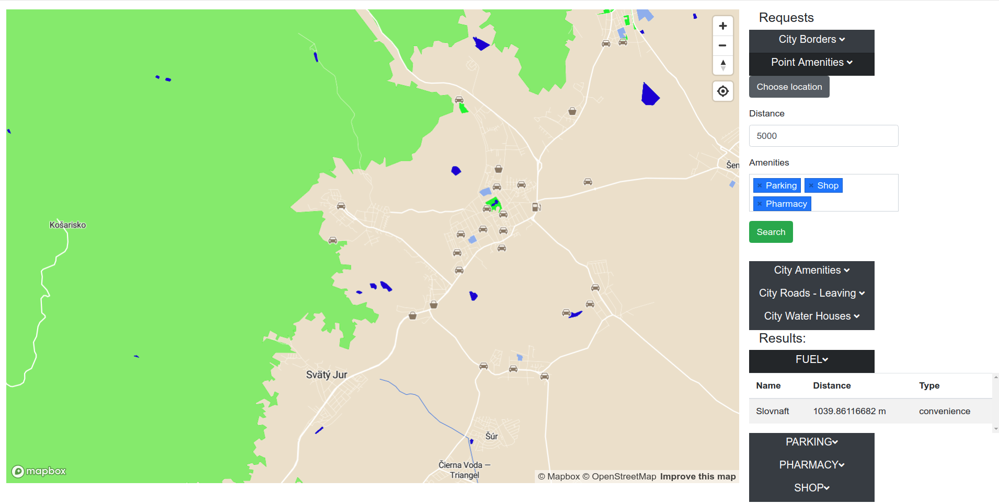

# Overview

This application shows interesting location on a map. The different scenarios include the following:

- Search for amenities by distance from a given point, while allowing the selection of amenities searched for.
  - The results are ordered by amenity and distance
  - Amenities coded by different symbols representing them on the map with a text description
- Showing additional information after click on drawn layers.
- Search for amenities in a given city
- Search for roads leaving a given city
- Search for houses (or buildings) near any type of water
- Grouping by type of result and displaying them in a simple table in addition to map
- Interaction with results - clicking on a row in table will cause the map to center on its location

The details for each sceeario are included in the [scenarios](#scenarios) part of this documentation.

This is it in action:



The application consists of 2 main parts. The [frontend](#frontend) part that is used for an interaction of the user with the application. The second part is the [backend](#backend) part written in Python Flask and is backed by a PostGIS database. These two parts communicate using request through [REST API](#api).

# Frontend

The frontend of the application is represented as a static HTML page. For the styling of this static page I am using a bootstrap4 library. In addition, the style of map is modified by me and the details can be found in the [layer](#layer) section.

The contents of the page include a map generated by a mapbox-gl.js and an information panel. The information panel is separated into two parts - the [Requests](#requests) part and [Results](#results) part.

All the relevant code is present in the `application.js`, where all the javascript methods are present and the `index.html` page that contains all the static HTML code (with a bitof javascript code). The responsibilities of the frontend code are:

- serializing user inputs and calling the REST API methods with these inputs
- displaying the map and the geo features by overlaying the map with a geojson layer, where the geojson is provided by the backend API
- displaying the sidebar results from backend API requests
- interaction of the sidebar results and the generated map layer (clicking a row centers the map on it)

## Requests
The requests part of the information part include all the [scenarios](#scenarios) implemented in the application. All the scenarios are represented as forms with different fields as the application requires an user input from multiple attribute possibilities (that are best represented as select boxes). To reduce the cognitive load on the user, only a single form can be shown at the same time - each form is wrapped in a hide-able element that can be triggered using buttons.

The forms present in this section are used to communicate with the [backend layer](#backend). The communication is realized as an AJAX request, that first serializes the specific form and calls the defined [REST API](#api) method provided (therefore all request are performed as a POST request with a payload body).

The results are returned in a GeoJSON format and handled by the [Results](#results) part.

## Results
All the results returned from the backend APIs are first displayed on the the generated by by overlaying it with a specific geojson layer (the type of layer is determined individually for each scenario and so are described [there](#scenarios))

In addition to displaying the results on the map, they are also displayed in the sidebar, to allow for better interaction. For each group type returned from the backend API, a displayable list is generated which contains the table with all the results belonging to this results set with all the properties set for the specific result (displayable again for the lack of space and the reduction of cognitive load). Each row is also clickable, which results in the centering of the map on the clicked result. As the table number of results can be quite large, the table is constrained to a static height and a scrollbar bar for it is provided.

## Layer
The style of the layer that is used for rendering a map is generated by me. It was used to better highlight the results. The list of changes to the basic format includes:

- All the texts and symbols for the points of interests are hidden as they could collide with symbols generated by the application
- The color of any type of water is highlighted - the water is much more obvious
- The color of the other natural occurencies is also highlighted - a brighter green is used for them
- All the hospitals are given a bright red color to be much better distinguishable
- All the school are given a light blue color to be better distinguishable
- All other buildings are given a rich black color after a certain zoom level (zoom level 15)
- The style of all fonts is changed along with its size

# Backend

The backend of the application is written in Python Flask server. It is responsible for connection to the database, user input validation, querying geo data from database, geojson formatting and prepropcessing and returning the data.

## Data

Data used in application is coming directly from the Open Street Maps. The data covers the whole Slovakia region and was imported directly using the `osm2pgsql` tool in a WGS 84 format. As the extent of the data is quite large, the different queries had to be sped up using different [indexes](#indexes). All the queries are built in the `app/modules/queries.py` file from where they are called in different API functions in `routes.py`. 

The return GeoJSON is generated directly in database using the `ST_AsGeoJSON` function. This function, however generates only the coordinates and therefore the generated GeoJSON had to be preprocessed in order to include properties in it.

## Scenarios

**Find city boundaries**

Used to find all the boundaries of the cities. Only the largest boundary for any given city is taken (determined by the way_area column).

This scenario does not use any type of relevant GIS function.

This scenario works with the `planet_osm_polygon` table.

GeoJSON layer used for the scenario is of type `fill`.

Clicking the element on layer generates popup with the name of the city.

*Query Example:*

```
SELECT DISTINCT ON(name) name, way_area, ST_AsGeoJSON(ST_Transform(way, 4326)::geometry) AS geom, 'polygon' AS type
FROM planet_osm_polygon
WHERE boundary = 'administrative'
AND admin_level = '9'
AND name is not null
ORDER BY name ASC, way_area DESC
```


**Find amenities from a given point**

Used to find all the specified amenities from the given point in the maximum distance (also specified by user). The results are sorted by the type of amenity and by the dstance from the point.

GIS functions used:

- ST_Distance_Sphere
- ST_DWithin
- ST_Centroid

This scenario works with the `planet_osm_polygon` table and the `planet_osm_point` table. The point from which the distance is measured is calculated at the query runtime using `ST_MakePoint`.

GeoJSON layer used for the scenario is of type `symbol`. The icon image is determined by the `amenity_key` property, while the textfield contents are determined by the `name` and `amenity` properties of GeoJSON. The text is visible only after zoom level 18.

Clicking the element on layer generates popup with the name of the amenity, the distance from the specified point and the type of amenity.

This scenario also generates a table in the [panel information section](#results). The table contains the name, distance and type of amenity. Clicking the row centers on the center of the amenity (for points it is the specified point, for polygons the generated centroid geojson coordinates are used).

*Query Example:*

```
SELECT name, amenity, shop, 'point' AS type,
ST_AsGeoJSON(ST_Transform(way, 4326)::geometry) AS geom,
ST_Distance_Sphere(ST_SetSRID(ST_MakePoint(17, 48),4326), ST_Transform(way, 4326)) AS distance, 
ST_AsGeoJSON(ST_Transform(ST_Centroid(way), 4326)::geometry) AS centroid
FROM planet_osm_point
WHERE (amenity in ('parking', 'pharmacy') OR shop is not null )
AND ST_DWithin(ST_SetSRID(ST_MakePoint(17, 48),4326)::geography, ST_Transform(way, 4326)::geography, 5000)
UNION
SELECT name, amenity, shop, 'polygon' AS type, 
ST_AsGeoJSON(ST_Transform(way, 4326)::geometry) AS geom, 
ST_Distance_Sphere(ST_SetSRID(ST_MakePoint(17, 48),4326), ST_Transform(way, 4326)) AS distance, 
ST_AsGeoJSON(ST_Transform(ST_Centroid(way), 4326)::geometry) AS centroid
FROM planet_osm_polygon
WHERE (amenity in ('parking', 'pharmacy') OR shop is not null)
AND ST_DWithin(ST_SetSRID(ST_MakePoint(17, 48),4326)::geography, ST_Transform(way, 4326)::geography, 5000)
ORDER BY amenity, distance
```

**Find amenities in given city**

Used to find all the specified amenities in a given city. A select box with search functionality is provided for the selection of city name. The results are ordered by the amenity type.

GIS functions used:

- ST_Contains
- ST_Centroid

This scenario works with the `planet_osm_polygon` table and the `planet_osm_point` table. The city polygon is generated from the `planet_osm_polygon` table. 

GeoJSON layer used for the scenario is of type `symbol`. The icon image is determined by the `amenity_key` property, while the textfield contents are determined by the `name` and `amenity` properties of GeoJSON. The text is visible only after zoom level 18.

Clicking the element on layer generates popup with the name of the amenity  and the type of amenity.

This scenario also generates a table in the [panel information section](#results). The table contains the name and type of amenity. Clicking the row centers on the center of the amenity (for points it is the specified point, for polygons the generated centroid geojson coordinates are used).

*Query Example:*

```
WITH city AS (
SELECT DISTINCT ON (name) name, way_area, way
FROM planet_osm_polygon
WHERE boundary = 'administrative'
AND admin_level = '9'
AND name = 'Pezinok' 
ORDER BY name ASC, way_area DESC
LIMIT 1
)
SELECT p.name, p.amenity, p.shop, 'point' AS type, 
ST_AsGeoJSON(ST_Transform(p.way, 4326)::geometry) as geom, 
ST_AsGeoJSON(ST_Transform(ST_Centroid(p.way), 4326)::geometry) AS centroid
FROM planet_osm_point p
JOIN city c ON st_contains(c.way, p.way)
WHERE (p.amenity in ('parking', 'pharmacy') OR p.shop is not null)
UNION
SELECT p.name, p.amenity, p.shop, 'polygon' AS type, 
ST_AsGeoJSON(ST_Transform(p.way, 4326)::geometry) as geom, 
ST_AsGeoJSON(ST_Transform(ST_Centroid(p.way), 4326)::geometry) AS centroid
FROM planet_osm_polygon p
JOIN city c ON st_contains(c.way, p.way)
WHERE (p.amenity in ('parking', 'pharmacy') OR p.shop is not null)
ORDER BY amenity
```

**Find roads leaving city**

Used to find all the roads that are crossing the boundary of the given city. The results are ordered by the type of the road.

GIS functions used:

- ST_Crosses
- ST_Length
- ST_Line_Interpolate

This scenario works with the `planet_osm_polygon` table and the `planet_osm_line` table. The city polygon is generated from the `planet_osm_polygon` table. 

GeoJSON layer used for the scenario is of type `line`. 

Clicking the element on layer generates popup with the name of the road, the length of the road and the type of road.

This scenario also generates a table in the [panel information section](#results). The table contains the name, length and type of road. Clicking the row centers on the center of the road (determined from the interpolated point in geojson format).

*Query Example:*

```
WITH city AS (
SELECT DISTINCT ON(name) name, way_area, way
FROM planet_osm_polygon
WHERE boundary = 'administrative'
AND admin_level = '9'
AND name = 'Pezinok'
ORDER BY name ASC, way_area DESC
LIMIT 1)
SELECT l.name, 'line' AS type, 
ST_AsGeoJSON(ST_Transform(l.way, 4326)::geometry) AS geom, 
ST_Length(ST_Transform(l.way, 26986)::geometry) AS len, 
ST_AsGeoJSON(ST_Line_Interpolate_Point(ST_Transform(l.way, 4326)::geometry, 0.5)) AS centroid, l.highway
FROM planet_osm_line l
JOIN city c ON st_crosses(l.way, c.way)
WHERE highway in ('residential', 'tertiary', 'primary', 'secondary', 'service')
ORDER BY highway
```

**Find buildings near water in city**

Used to find all the buildings that are at maximum 500 meters from any water type (lake, river) in a given city. The results are ordered by the type of the building.

GIS functions used:

- ST_Intersects
- ST_Buffer
- ST_Area
- ST_Centroid

This scenario works with the `planet_osm_polygon` table. The city polygon is generated from the `planet_osm_polygon` table. The water polygons and buffers are generated from the `planet_osm_polygon` table.

GeoJSON layer used for the scenario is of type `fill`. 

Clicking the element on layer generates popup with the name of the building, its area, address of the building and the type.

This scenario also generates a table in the [panel information section](#results). The table contains the name, area, address and type of building. Clicking the row centers on the center of the building (determined from the centroid generated in databse in geojson format).

*Query Example:*

```
WITH city AS (
SELECT DISTINCT ON(name) name, way_area, way
FROM planet_osm_polygon
WHERE boundary = 'administrative'
AND admin_level = '9'
AND name = 'Pezinok'
ORDER BY name ASC, way_area DESC
LIMIT 1)
water AS (
SELECT st_buffer(st_transform(w.way, 4326)::geography, 500) AS way FROM planet_osm_polygon w
JOIN city c ON st_intersects(st_buffer(st_transform(w.way, 4326)::geography, 500), st_transform(c.way, 4326)::geography)
WHERE w.water is not null OR w.natural in ('water', 'lake', 'river')
)
SELECT h.name AS name, h."addr:housename" AS house, h."addr:housenumber" AS number, 
ST_Area(ST_Transform(h.way, 4326)::geography) AS area, 
'polygon' AS type, 
ST_AsGeoJSON(ST_Transform(h.way, 4326)::geometry) AS geom, 
ST_AsGeoJSON(ST_Transform(ST_Centroid(h.way), 4326)::geometry) AS centroid, 
h.building
FROM planet_osm_polygon h
JOIN water w ON st_intersects(st_transform(h.way, 4326)::geography, w.way)
JOIN city c ON st_intersects(h.way, c.way)
WHERE building in ('yes', 'garage', 'house', 'apartmenrs', 'detached', 'residential', 'garages', 'hut', 'cabin', 'hotel')
ORDER BY building
```


## Indexes
Different indexes where specified, but not all of them were used as they did not provide any imporvements. Following is the list of some of the more relevant indexes.

**Geography Transformed Polygon**

```
CREATE INDEX geography_transformed_polygon ON planet_osm_polygon USING gist( geography(ST_Transform(way, 4326)) );
```

One of the most important index. The data imported to the database were in WGS 84 format, however mapbox requires a geojson in the format lnglat and therefore all the geometries had to be transformed to lnglat format (4326). Also in order to use meters in some functions, these functions required the geometry to be transformed this way. The geography functions was used as some of the functions required the geometry to be in geogprahy format and so a cast is often needed, however as it turns out it is not required in an index.

**Geography Transformed Point**

```
CREATE INDEX geography_transformed_point ON planet_osm_point USING gist( geography(ST_Transform(way, 4326)) );
```

One of the most important index. Same reasoning as in the previous index.

**Polygon Name Way Area sort**

```
CREATE INDEX polygon_name_way_area_sort ON planet_osm_polygon(name, way_area);
```

One of the more important index. This index allows for much faster sorting of the city polygons that is used in multiple queries.

**Indexes on non-geometry columns**

```
CREATE INDEX polygon_amenity ON planet_osm_polygon(amenity);
CREATE INDEX polygon_shop ON planet_osm_polygon(shop);
CREATE INDEX polygon_building ON planet_osm_polygon(building);
CREATE INDEX polygon_water ON planet_osm_polygon(water);
CREATE INDEX polygon_natural ON planet_osm_polygon("natural");
CREATE INDEX point_amenity ON planet_osm_point(amenity);
CREATE INDEX point_shop ON planet_osm_point(shop);
CREATE INDEX line_highway ON planet_osm_line(highway);
```

Indexes used for faster filtering of rows by the non-geometry columns. The speed increase is not as significant as with the geo indexes, however the increase is still relevant.

**Indexes that were not really used**

```
CREATE INDEX geometry_transformed_polygon ON planet_osm_polygon USING gist( geometry(ST_Transform(way, 4326)) );
CREATE INDEX geometry_transformed_point ON planet_osm_point USING gist( geometry(ST_Transform(way, 4326)) );
```

Only difference with first two indexes is the use of geometry function instead of geography, however this provides no real benefit the the high cost.

```
CREATE INDEX geometry_simple_polygon ON planet_osm_polygon USING gist( way );
CREATE INDEX geometry_simple_point ON planet_osm_point USING gist( way );
CREATE INDEX geometry_simple_line ON planet_osm_line USING gist( way );
```

Indexes for the non-transformed geo columns. These would have a meaning if the import from the Open Street Maps did not already had them defined.

```
CREATE INDEX geography_buffer_polygon ON planet_osm_polygon USING gist( st_buffer( geography(st_transform(way, 4326)), 500 ) );
```

Index for speeding up the slowest query in the application, however it did not provide any real benefit.

## Api

**Find city boundaries**

`GET /cities_geojson`

*Response:* 

Call returns the GeoJSON of city polygons.
Set GeoJSON properties:

- name

**Find amenities from point**

`POST /amenities_from_point`

*Body parameters:*

- lng: Longitude of the specified point
- lat: Latitude of the specified point
- distance: Maximum distance from the specified point
- amenities: List of all amenities searched for 

*Response:*

Call returns the GeoJSON of all the amenities found in the maximum distance from the specified point.
Set GeoJSON properties:

- name
- distance
- centroid: center of the gemotry in geojson format
- amenity: humanized name
- amenity_key: as defined in database
- shop: type of shop

**Find amenities in city**

`POST /amenities_in_city`

*Body parameters:*

- city: Name of the specified city
- amenities: List of all amenities searched for 

*Response:*

Call return the GeoJSON of all the amenities in given city.
Set GeoJSON properties:

- name
- centroid: center of the gemotry in geojson format
- amenity: humanized name
- amenity_key: as defined in database
- shop: type of shop


**Find roads leaving the city**

`POST /roads_leaving_city`

*Body parameters:*

- city: Name of the specified city

*Response:*

Call return the GeoJSON of all the roads leaving the given city.
Set GeoJSON properties:

- name
- len: length of the line
- highway: type of road
- centroid: interpolated middle of the road

**Find building in city near water**

`POST /city_water_houses`

*Body parameters:*

- city: Name of the specified city

*Response:*

Call return the GeoJSON of all the buildings near water in the given city.
Set GeoJSON properties:

- name
- house: street name of the house (often null)
- number: house number
- area: area of the building in m2
- building: type of building
- centroid: center of the gemotry in geojson format